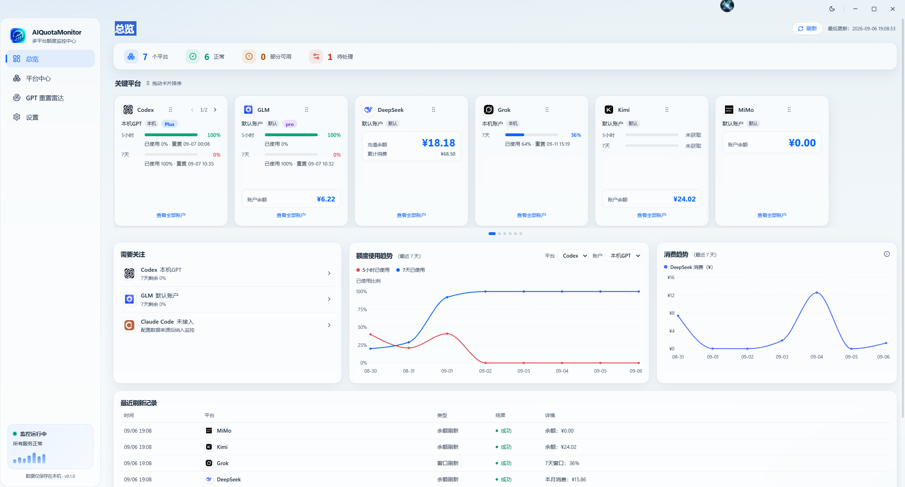
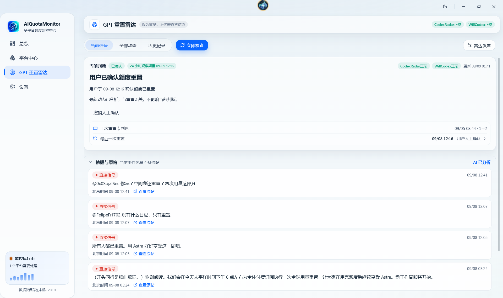
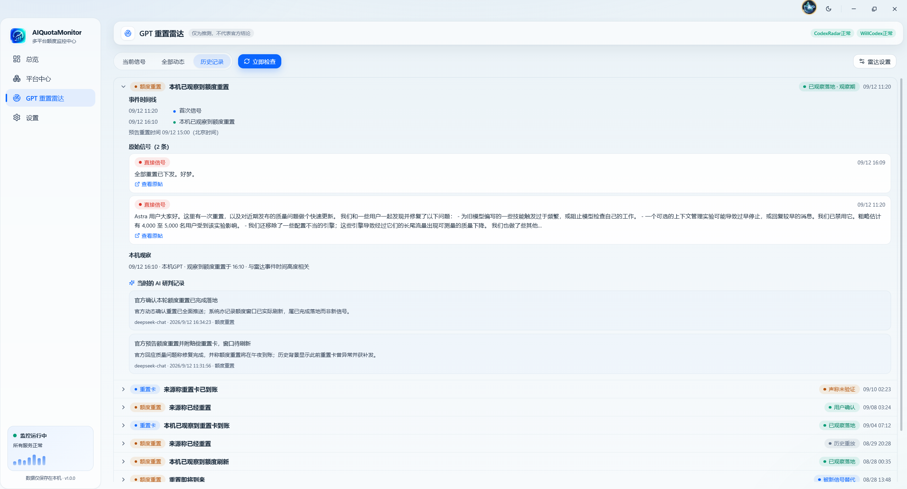

<p align="center">
  
</p>

<h1 align="center">AIQuotaMonitor</h1>

<p align="center"><strong>多平台 AI 额度，一处看清。</strong><br>余额、订阅窗口、消费趋势与 GPT 重置信号，常驻你的 Windows 桌面。</p>

<p align="center">
  <a href="https://github.com/curry880314/AIQuotaMonitor/releases/latest"></a>
  <a href="LICENSE"></a>
</p>

<p align="center">
  <a href="#快速开始">快速开始</a> · <a href="#桌面速览">桌面速览</a> · <a href="#平台支持">平台支持</a> · <a href="#从源码运行">从源码运行</a>
</p>



<p align="center"><sub>Windows 10 / 11 · Tauri 2 + React + Rust · 浅色 / 深色主题</sub></p>

## 额度、余额和重置时间，放在一起

同时使用 Codex、Claude Code 和多个 API 平台时，AIQuotaMonitor 帮你集中查看各账号还剩多少额度、窗口何时刷新，以及消费如何变化。

| 你关心的事 | 在这里查看 |
| --- | --- |
| 哪个账号快用完了？ | 总览按平台与账号展示额度窗口、剩余比例和重置时间 |
| API 余额还剩多少？ | 平台中心查看余额、消费、模型用量与缓存效率，按来源能力展示 |
| 工作时想随手看一眼？ | 悬浮球停靠屏幕四边，悬停展开额度卡片 |
| GPT 是否有新的重置信号？ | 重置雷达汇集公开动态、本机观察与可选 AI 分析 |

## 快速开始


1. 从 [Releases 下载 Windows 安装包](https://github.com/curry880314/AIQuotaMonitor/releases/latest)，完成安装并启动。
2. 打开 **平台中心 → 添加平台**，选择正在使用的平台。
3. API 平台填写 Key 并验证后保存；GPT / Codex、Claude Code、Grok 检测本机官方组件的登录状态；需要网页会话的来源按提示登录。
4. 返回 **总览** 查看额度，在 **设置 → 悬浮球** 中开启桌面速览。

GPT 额外账号通过官方 Codex 组件打开浏览器登录，会话保存在独立目录，不覆盖本机账号。不同平台可查询的字段见下方支持表。

## 桌面速览

### 屏幕边缘，随时展开

五边形玻璃悬浮球支持顶、底、左、右停靠。展开后按平台与账号查看额度、余额和重置时间，也可刷新数据或进入雷达详情。

https://github.com/user-attachments/assets/2f077e10-41da-48a3-897b-021cf6d3fd29

演示包含多平台额度滚动、深浅主题切换、雷达详情，以及小球展开与收起。


### GPT 重置雷达，判断有据可查

汇集 CodexRadar、WillCodex 公开页面，结合本机额度观察，分别追踪 **额度重置** 与 **重置卡到账**。可以查看引用原文、检查历史，并记录或撤销自己的确认。

**雷达判断仅为推测，不代表官方结论。** AI 分析默认关闭；关闭后仍可同步来源与查看本机观察。



<details>
<summary>查看事件历史：从首次信号到本机观察</summary>



</details>

截图展示拍摄时的界面与数据；当前账号额度以应用刷新结果为准。点击图片可查看原图。

## 平台支持

| 平台 | 额度来源 | 可查看的能力 |
| --- | --- | --- |
| **GPT / Codex** | 本机 app-server / WHAM | 5 小时、7 天窗口，额外余额，可用重置卡 |
| **Claude Code** | 本机 CLI OAuth | 5 小时 / 7 天 / Opus / Sonnet 窗口 |
| **Grok** | 本机 CLI | SuperGrok 7 天窗口 |
| **DeepSeek** | 官方余额 API + 网页用量 | 余额、消费、模型 Token、缓存命中率、消费趋势 |
| **GLM** | 官方 Coding / Token Plan + 网页个人余额 | 窗口额度、剩余比例、个人余额 |
| **Kimi** | 官方 Coding Plan + Moonshot 余额 | 窗口额度、余额 |
| **MiniMax** | 官方 Coding / Token Plan（国内 / 国际） | 窗口额度 |
| **MiMo** | 网页会话 | 余额 |
| **SiliconFlow / StepFun / OpenRouter / Novita** | 官方余额 API | 余额；OpenRouter 另有累计消费 |

展示能力取决于账号套餐和来源实际返回的字段。部分网页能力及 Codex WHAM 依赖内部接口，可能随平台调整变化。接入细节见 [平台接入说明](docs/product/platform-access.md)。

## 数据如何处理

- **失败保留上次结果**：来源独立刷新与缓存，一个来源失败不清空其他来源的成功数据。有历史快照时标记 `stale`，从未取得真实值时显示 `missing`，不补零。
- **凭据与快照分开存储**：API Key、Token、Cookie 存入 Windows Credential Manager；SQLite 保存配置、快照与凭据引用。前端只接收脱敏数据，金额使用 Decimal / 文本定点值。
- **联网用途明确**：额度查询访问对应平台，雷达读取公开页面；开启可选 AI 时，将分析所需的原文与上下文发给你配置的模型服务。额度快照存储在本机。
- **网页登录隔离**：登录窗口不授予应用 Tauri IPC 权限。平台 Logo 仅用于识别，商标归各平台所有者。

安全问题请按 [安全策略](SECURITY.md) 使用私密渠道报告。

## 从源码运行

需要 Windows 10 / 11、Node.js ≥ 20、pnpm、Rust 1.85+，以及 [Tauri 前置依赖](https://tauri.app/start/prerequisites/)（WebView2、Visual Studio C++ Build Tools）。

```powershell
git clone https://github.com/curry880314/AIQuotaMonitor.git
cd AIQuotaMonitor
pnpm install
pnpm dev
```

<details>
<summary>构建安装包与开发检查</summary>

```powershell
# 构建 Windows 安装包
pnpm package

# TypeScript、前端构建与 Rust 检查
pnpm --filter @ai-quota-monitor/desktop typecheck
pnpm --filter @ai-quota-monitor/desktop build
cargo check --manifest-path apps/desktop/src-tauri/Cargo.toml
```

默认安装包产物目录：`apps/desktop/src-tauri/target/release/bundle/`。

</details>

<details>
<summary>代码结构与设计文档</summary>

```text
apps/desktop/
├─ src/              React 主窗口、悬浮球与共享组件
└─ src-tauri/src/    Rust 平台适配器、刷新、存储与窗口管理
docs/
├─ architecture/     架构与技术选型
├─ product/          产品需求与平台接入
├─ screenshots/      README 产品截图
└─ ui-design/        设计稿归档
tooling/             开发、迁移与打包脚本
```

领域模型：`Platform → Account → Source → Capability → Snapshot`。React 通过 Tauri IPC 消费脱敏 ViewModel；平台差异由 Rust Source adapter 处理，应用不启动独立 HTTP 后端。

[架构概览](docs/architecture/overview.md) · [技术选型](docs/architecture/technology-decision.md) · [产品需求](docs/product/requirements.md)

</details>

## 参与项目

[报告 Bug](.github/ISSUE_TEMPLATE/bug_report.md) · [贡献指南](CONTRIBUTING.md) · [行为准则](CODE_OF_CONDUCT.md) · [版本变更](CHANGELOG.md)

采用 [MIT License](LICENSE)。迁移的第三方代码在对应文件头保留来源与许可声明。
