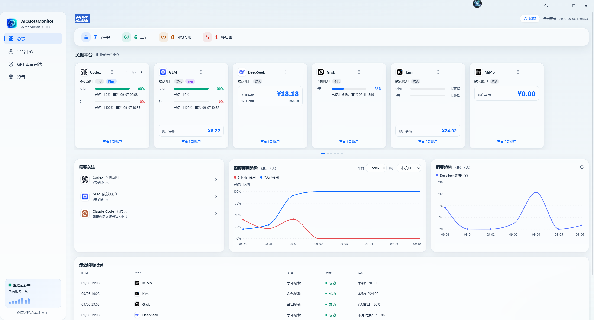
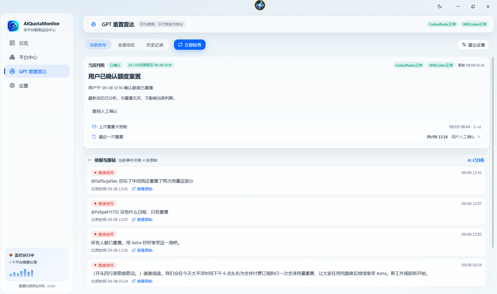
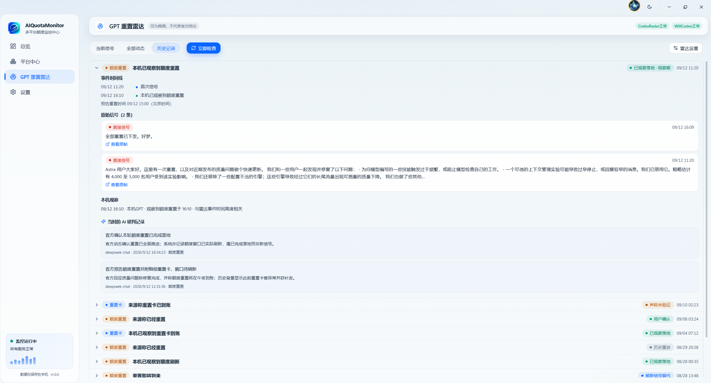

<p align="center">
  
</p>

# AIQuotaMonitor

在 Windows 桌面集中查看 AI 平台的额度、余额、消费趋势和重置时间。支持多账号、屏幕边缘悬浮球，以及 GPT 重置信号追踪。

[下载 Windows 安装包](https://github.com/kkfor30/AIQuotaMonitor/releases/latest) · [平台支持](#平台支持) · [从源码运行](#从源码运行)



Windows 10 / 11 · 浅色 / 深色主题 · Tauri 2 + React + Rust

## 快速开始


1. 下载并安装 [Windows 版本](https://github.com/kkfor30/AIQuotaMonitor/releases/latest)。
2. 打开 **平台中心 → 添加平台**，选择平台并按提示验证 API Key、本机登录或网页会话。
3. 在 **总览** 查看额度，在 **设置 → 悬浮球** 开启桌面速览。

GPT 额外账号通过官方 Codex 组件登录，会话保存在独立目录，不覆盖本机账号。

## 桌面速览

悬浮球可停靠屏幕四边，悬停展开各账号的额度、余额和重置时间，也可刷新数据或进入雷达详情。

https://github.com/user-attachments/assets/2f077e10-41da-48a3-897b-021cf6d3fd29

## GPT 重置雷达

汇集 CodexRadar、WillCodex 的公开动态，结合本机观察，分别追踪额度重置与重置卡到账。可查看原文、历史记录，并确认或撤销自己的观察。

**雷达判断是推测，不代表官方结论。** AI 分析默认关闭，关闭后仍可同步来源与查看本机观察。



<details>
<summary>查看事件历史截图</summary>



</details>

截图与视频为演示，当前账号数据以应用刷新结果为准。

## 平台支持

| 平台 | 接入方式 | 可查看内容 |
| --- | --- | --- |
| GPT / Codex | 本机 app-server / WHAM | 当前账号实际返回的额度窗口（如 5 小时、7 天、30 天），额外余额，重置卡 |
| Claude Code | 本机 CLI OAuth | 5 小时、7 天、Opus、Sonnet 窗口 |
| Grok | 本机 CLI | SuperGrok 7 天窗口 |
| DeepSeek | 官方 API + 网页用量 | 余额、消费、模型 Token、缓存命中率与趋势 |
| GLM | 官方 Coding / Token Plan + 网页余额 | 窗口额度、剩余比例、个人余额 |
| Kimi | 官方 Coding Plan + Moonshot 余额 | 窗口额度、余额 |
| MiniMax | 官方 Coding / Token Plan（国内 / 国际） | 窗口额度 |
| MiMo | 网页会话 | 余额 |
| SiliconFlow / StepFun / OpenRouter / Novita | 官方 API | 余额；OpenRouter 另有累计消费 |

字段取决于账号套餐和来源返回值。部分网页能力及 Codex WHAM 依赖内部接口，可能随平台调整变化。详见 [平台接入说明](docs/product/platform-access.md)。

## 数据与隐私

- 各来源独立刷新。失败时保留历史结果并标记过期；从未取得数据时显示缺失，不补零。
- Key、Token、Cookie 存入 Windows Credential Manager，配置和额度快照保存在本机 SQLite；前端只接收脱敏数据。
- 额度查询访问对应平台，雷达读取公开页面；启用 AI 分析后，所需原文和上下文会发送给你配置的模型服务。
- 网页登录窗口不授予应用 Tauri IPC 权限。平台 Logo 仅用于识别，商标归各平台所有者。

安全问题请通过 [安全策略](SECURITY.md) 中的私密渠道报告。

## 从源码运行

需要 Windows 10 / 11、Node.js ≥ 20、pnpm、Rust 1.85+，以及 [Tauri 前置依赖](https://tauri.app/start/prerequisites/)（WebView2、Visual Studio C++ Build Tools）。

```powershell
git clone https://github.com/kkfor30/AIQuotaMonitor.git
cd AIQuotaMonitor
pnpm install
pnpm dev
```

<details>
<summary>构建与开发检查</summary>

```powershell
pnpm package
pnpm --filter @ai-quota-monitor/desktop typecheck
pnpm --filter @ai-quota-monitor/desktop build
cargo check --manifest-path apps/desktop/src-tauri/Cargo.toml
```

安装包输出到 `apps/desktop/src-tauri/target/release/bundle/`。

</details>

[架构概览](docs/architecture/overview.md) · [技术选型](docs/architecture/technology-decision.md) · [产品需求](docs/product/requirements.md)

## 参与项目

[报告 Bug](.github/ISSUE_TEMPLATE/bug_report.md) · [贡献指南](CONTRIBUTING.md) · [行为准则](CODE_OF_CONDUCT.md) · [版本变更](CHANGELOG.md)

采用 [MIT License](LICENSE)。第三方代码的来源与许可声明保留在对应文件中。
