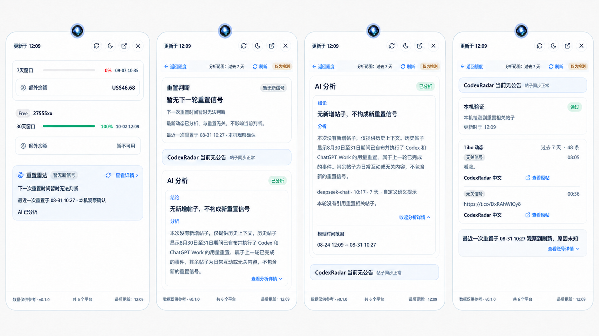

# GPT 重置雷达紧凑控制台 UI V4

更新时间：2026-09-02

## 结论

本目录是 GPT 重置雷达下一轮 React/CSS 改造的最终视觉参考，覆盖 `2026-09-02-gpt-radar-ui-v3/` 的页面布局与材质方向；V3 已实现的数据语义、状态文案和事实归属继续保留。

- 主窗口采用用户确认的第 3 版「紧凑控制台」。
- 悬浮页不重构，只在现有两级页面、尺寸、滚动和状态机上做轻量视觉收口。
- 功能、ViewModel、IPC、Rust 事件协调器和 SQLite 均不因本设计改变。

## 最终参考稿

### 主窗口


参考图确定布局、密度、边框、留白和视觉层级，不是数据契约。图片中的以下生成内容禁止照抄：

- `支持重置信号`、`置信度 76%` 等不存在于当前 ViewModel 的示例语义。
- `通过`、`立场切换`、`复制分析` 等未在现有产品中定义的操作。
- 示例帖子、余额、时间、比例和状态。

实现时必须使用现有 `RadarDecision`、`RadarAiAssessment`、`QuotaVerification`、`RadarNotice`、`RadarPost` 和检查历史字段。

### 悬浮页



状态板依次表达：额度页雷达摘要、雷达详情首屏、AI 分析展开、下滚后的本机验证/Tibo/最近一次重置。它只规定视觉收口，现有交互结构优先于图片。

## 主窗口信息架构

```text
页面标题 / 说明 / 立即检查
信号摘要 / Tibo 动态 / AI 辅助分析    动态范围

[当前判断] [最近一次重置] [本机验证]

[AI 分析，约 60%]        [CodexRadar 公告]
[结论、分析、正向依据]    [Tibo 最近动态，约 40%]

[最近一次重置，可折叠]
[检查历史，可折叠]
```

- 三张状态卡等高、紧凑，负责快速回答「现在怎样 / 上次何时 / 本机是否验证」。
- AI 分析是主工作区，不再用大面积浅蓝底；结论和分析正文保持现有事实语义。
- 公告位于右栏顶部，Tibo 预览只展示当前范围最近 3 条；完整列表仍在 `Tibo 动态` Tab。
- `查看分析详情` 改为 AI 卡标题右侧的文字折叠操作，不再作为正文底部孤立按钮。
- 最近一次重置与检查历史仍默认折叠，不能因顶部状态卡存在而删除历史详情。

## 悬浮页不可变交互

- 保留 `quota → radar` 两级页面；从雷达页点「返回额度」才回额度列表。
- 悬浮详情隐藏后再次唤出，保留上次所在页面。
- 额度页和雷达页共用现有纵向滚动容器；顶部全局操作和底部信息条继续固定。
- 雷达页 sticky 工具栏继续显示「返回额度 / 分析范围 / 刷新 / 仅为推测」。
- 顶部/底部停靠为 420px，左/右停靠为 300px；四边不得横向溢出。
- 保留刷新/终止、翻译、查看原帖、确认/撤销、本机额度重试、账号详情和最近重置折叠。
- 不新增底部「在主窗口打开」大按钮，不把悬浮页改成独立仪表盘。

## 悬浮页视觉调整

- 外框、锚点、头部圆形按钮、底栏和平台额度布局不变。
- 普通卡片改为近白实体层、细灰蓝边框和极轻阴影，降低大面积蓝色填充。
- 公告继续是单行细条；AI 卡去除内部蓝色套卡感。
- AI 分析详情开关改为右对齐文字操作加箭头，展开内容仍留在当前卡片内。
- Tibo 动态使用条目分隔线，减少卡片套卡片；标签、时间、翻译和原帖操作不删。

## 事实与状态底线

- 最近一次重置只认本机 observation 或用户确认。
- `possible_reset` 只能显示「疑似额度刷新」，不得显示为已重置。
- 当前正向依据只取当前分析 `citations ∩ newPostIds`。
- 历史引用只进入最近一次重置/历史分析。
- AI 关闭不影响来源同步、Tibo、本机观察和确定性判断。
- 范围切换后，旧范围分析不得继续标为当前「已分析」。
- 没有真实值时保持 missing，不补零、不从设计图复制示例数据。

## 响应式与主题

- 主窗口宽屏使用 3 张状态卡和约 60/40 双栏；容器不足时状态卡自动换行、主体改为单栏，不允许产生横向滚动。
- 浅色沿用冰蓝银白背景，但内容卡更接近实体白；深色沿用午夜石墨蓝 Token，不新增另一套颜色常量。
- 优先复用 `tokens.css`、现有 `glass-panel`、状态徽章和折叠动画，不引入新 UI 框架。

## 实施入口

- 修改方案：[`IMPLEMENTATION.md`](./IMPLEMENTATION.md)
- GLM 执行 Prompt：[`PROMPT.md`](./PROMPT.md)
