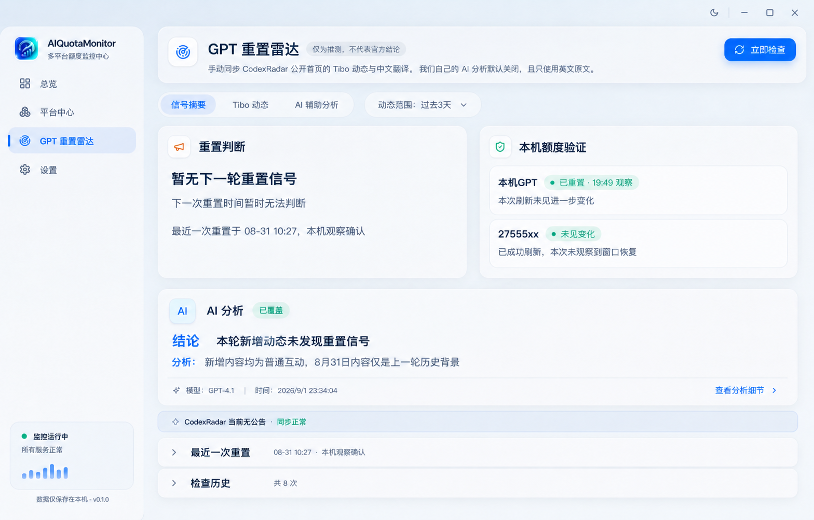
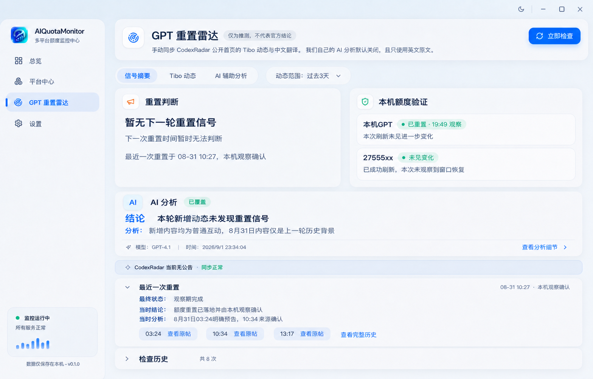
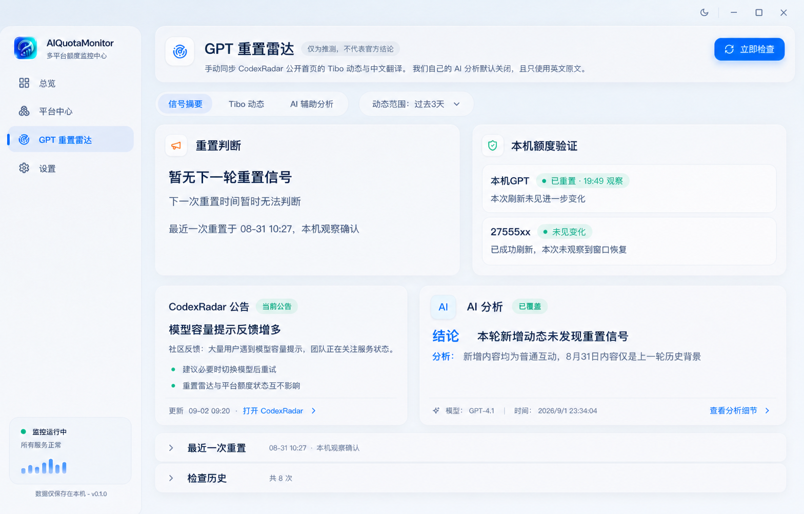
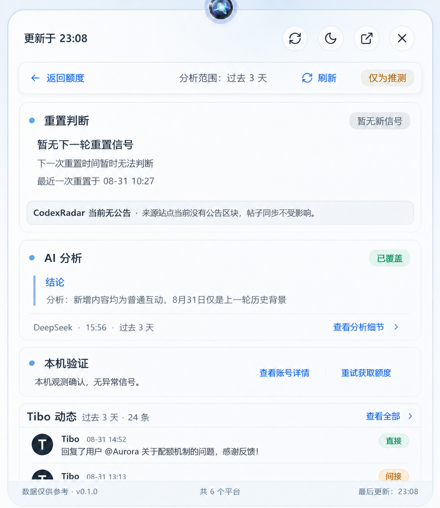

# GPT 重置雷达 UI V3

> 视觉布局已由 [`../2026-09-02-gpt-radar-compact-console-v4/`](../2026-09-02-gpt-radar-compact-console-v4/) 取代；本目录继续作为已实现的数据语义、状态文案和事实归属参考。

更新时间：2026-09-02

## 目标

页面优先回答四个问题：当前是否出现下一轮重置信号、预计何时重置、最近一次实际重置时间、AI 的结论是否有原帖依据。当前判断、历史重置、来源声称、本机观察和用户确认必须分开。

## 最终参考稿

### 主窗口信号摘要



以该稿的信息层级为基础，但实施时必须应用以下最终批注：

- 移除 AI 分析标题旁的方形装饰图标；顶部 `AI 辅助分析` Tab 保留。
- `结论` 与 `分析` 为同级标题，字号、字重、左边距和间距一致。
- AI 状态 `已覆盖` 改为 `已分析`，仅表示当前输入边界已有成功分析。
- 页面布局固定为：重置判断/本机额度验证双卡 → 公告细条 → AI 全宽卡 → 最近一次重置 → 检查历史。

### 最近一次重置展开态



实施时只保留时间、确认方式、最终状态、当时结论与当时分析。删除原帖列表、查看完整历史和大量时间按钮。`08-31 10:27` 一类真实重置时间必须突出显示，且只能来自本机 observation 或用户确认。

### CodexRadar 公告存在态



该稿只用于公告内容与状态参考。最终布局不采用四张等权卡片：公告改为全宽细条，AI 分析改为全宽卡片。

### 悬浮雷达详情



实施时删除 AI 卡左侧彩色竖条；`结论` 与 `分析` 使用同级样式。顶部返回工具栏保持 sticky，动态范围始终可见。

## 信息架构

### 主窗口

```text
信号摘要 / Tibo 动态 / AI 辅助分析       动态范围：当天 / 过去3天 / 过去7天

[重置判断]                 [本机额度验证]
[CodexRadar 公告细条，全宽]
[AI 分析，全宽]
[最近一次重置，可折叠]
[检查历史，可折叠]
```

动态范围复用 `analysisPrefs.rangeKey`，同时控制 Tibo 列表和 AI 上下文；AI 关闭时仍可设置。CodexRadar 来源同步不受该范围影响。

### 悬浮页

摘要页只显示当前判断、下一次时间、最近一次真实重置、AI 状态和查看详情入口。详情页顺序固定为：重置判断 → 公告 → AI 分析 → 本机验证 → Tibo 动态 → 最近一次重置。

## 内容与事实归属

- 当前判断只描述当前一轮，不用历史事件解释“本轮暂无信号”。
- 最近一次重置只认 `observed_reset_at` 或 `user_confirmed_reset_at`，不得回退帖子时间、来源声称时间、关闭时间或分析时间。
- AI 的正向依据只展示当前分析真实引用的帖子，显示信号类型、发布时间、摘要和原帖链接，不显示裸帖子 ID。
- Tibo 动态保留所选范围内完整倒序列表，并标注直接信号、间接信号和无关信号；无关信号不得进入正向依据。
- CodexRadar 公告来自公开首页公告区块，不发送给 AI，也不参与重置结论。
- 本次刷新未变化不等于历史重置未发生；事件关闭后不得重新显示为“待本机验证”。

## 状态文案

| 状态 | 徽章 | 主结论 |
| --- | --- | --- |
| `no_signal` | 暂无新信号 | 暂无下一轮重置信号 |
| `watching` | 观察中 | 发现可能的重置信号 |
| `upcoming` | 预计重置 | 预计即将重置 |
| `expected_time_passed` | 等待验证 | 预告时间已过，等待验证 |
| `landed_claimed` | 待验证 | 来源称已经重置 |
| `landed_observed` | 本机已观察 | 本机已观察到额度重置 |
| `user_confirmed` | 用户已确认 | 用户已确认额度重置 |

AI 状态固定为：`covered → 已分析`、`pending → 待分析`、`failed → 分析失败`、`disabled → AI 未启用`、`historical → 历史分析`、无成功结果 → `未分析`。

## 过程稿

其余 11 张设计过程稿原名保存在 [`assets/archive`](./assets/archive/)。过程稿仅用于追溯，不覆盖本 README 的最终批注与状态规范。
